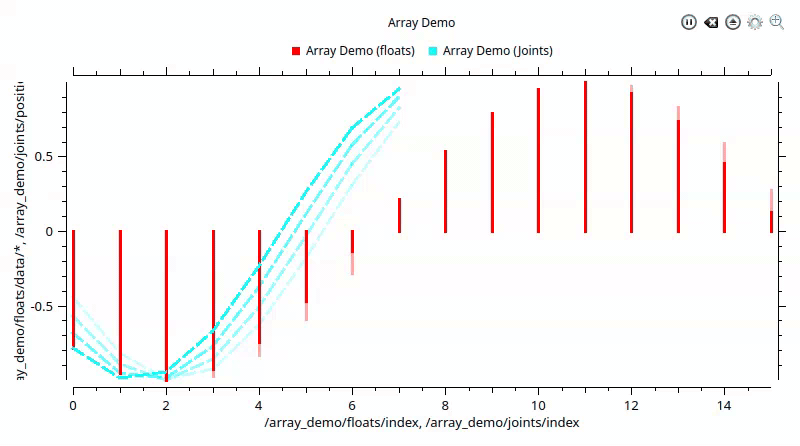
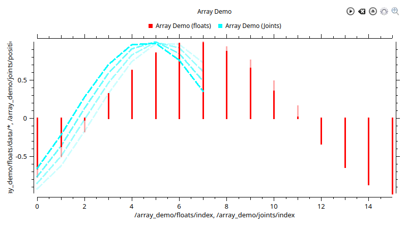
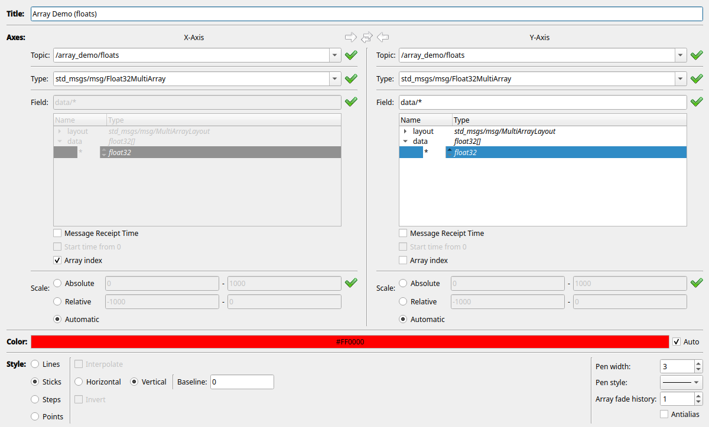
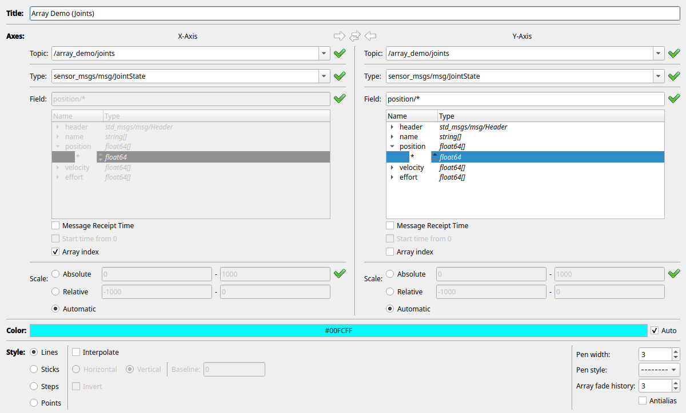
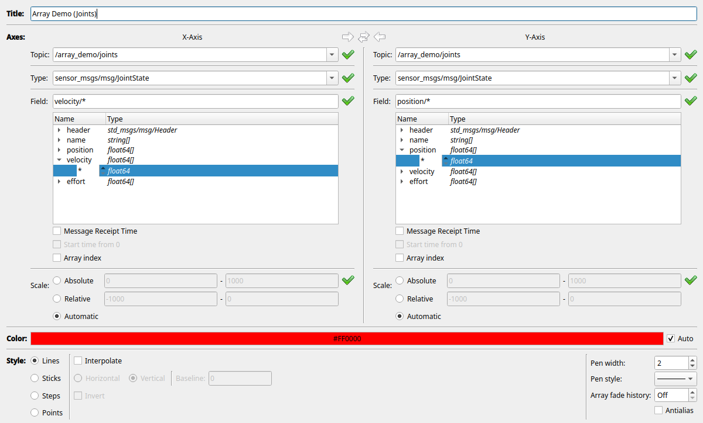

# Rqt Multiplot Plugin

[](https://github.com/samuelba/rqt_multiplot_plugin/actions/workflows/ci.yml?query=branch%3Amain)

rqt plugin for ROS 2 that plots numeric message fields in tiled 2D plots ([Qwt](https://qwt.sourceforge.io)).

**Author(s):** Ralf Kaestner, Samuel Bachmann

**Maintainer:** Samuel Bachmann

**License:** GNU Lesser General Public License v3.0 (LGPL-3.0)

**ROS2 distributions:** Jazzy, Kilted, Lyrical, Rolling

## Features

- **Multiple plots and curves** — split any plot horizontally or vertically; each plot can hold many curves
- **Tabs** — multiple named plot layouts in one window; each tab has its own layout, colors, and link/track settings
- **Live topics and rosbag2** — subscribe while running, or import `.mcap` / `.db3` files and bag directories
- **Linked plots** — shared scale and cursor; optional point tracking under the pointer
- **Export** — PNG, SVG, PDF images; TXT or CSV curve data
- **Reusable layouts** — save and load XML configurations (`file://`, `home://`, `package://`); older row×column files still load
- **[Array curves](#array-curves)** — plot a whole array vs index (or vs another array field); the series is replaced on each message

Also: run / pause / clear, message receipt time, start time from 0, circular and time-frame buffers, and drag-and-drop of curves between plot legends.


## Installation

### ROS distribution

**Coming soon.** The package is not on the ROS build farm yet. After release:

```shell
sudo apt-get update
sudo apt-get install ros-jazzy-rqt-multiplot
sudo apt-get install ros-kilted-rqt-multiplot
sudo apt-get install ros-lyrical-rqt-multiplot
sudo apt-get install ros-rolling-rqt-multiplot
```

### Building from source

Tested on ROS 2 Jazzy, Kilted, Lyrical, and Rolling. Put this repository in a colcon workspace `src` folder (clone or symlink), then:

```shell
cd ~/colcon_ws
rosdep install --from-paths src --ignore-src -y
colcon build --packages-select rqt_multiplot
source install/setup.bash
```

## Usage

Standalone plugin:

```shell
ros2 run rqt_multiplot rqt_multiplot
```

Or start rqt and load **Plugins → Visualization → Multiplot**:

```shell
rqt --force-discover
```

If the plugin list or layout is broken:

```shell
rqt --clear-config
```

Load a configuration, a bag, and start plotting:

```shell
ros2 run rqt_multiplot rqt_multiplot -- \
  --multiplot-config file:///path/to/layout.xml \
  --multiplot-bag /path/to/bag \
  --multiplot-run-all
```

| Option | Meaning |
| --- | --- |
| `--multiplot-config` / `-c` | XML layout URL |
| `--multiplot-bag` / `-b` | rosbag2 file or directory |
| `--multiplot-run-all` / `-r` | Start all plots immediately |

### Plot interaction

| Input | Action |
| --- | --- |
| Left drag | Pan |
| Ctrl + left drag | Draw a rectangle to zoom |
| Mouse wheel | Zoom in / out |
| Right click | Reset zoom |
| Hover (Points enabled) | Crosshair; nearest-sample marker and title / x, y readout |
| Drag a legend item onto another plot | Copy that curve |

Use the plot toolbar to run, pause, clear, configure, export, split (left / right / top / bottom), maximize, or close one plot. Drag a splitter handle to resize panes; those ratios are stored in the XML. Older row×column files still load.

**Link Scale** keeps axis ranges in sync across the plots. **Link Cursor** moves the crosshair on every plot. **Track Points** marks the nearest sample on each curve and shows its title and x, y.

The timer and calendar toggles set the X-axis time labels for the active tab: start from zero (default), date and time (`HH:mm:ss.z` / `yyyy MMM dd` UTC), or raw timestamps. Only one of those two can be on; both off shows the timestamp. Array-index and other numeric X axes are unchanged.

### Configure a plot

Open the gear on a plot. Add curves, set axis titles, legend, and plot rate.


### Edit a curve

Pick topic, message type, and field for each axis. X and Y can come from different topics.


Useful curve options:

- **Message receipt time** — plot against the time the message arrived
- **Circular buffer** / **Time frame** — keep a fixed number of points or the last *n* seconds

Whole-array fields use a different curve mode. See [Array curves](#array-curves).

### Import a bag

Configure the curves first (topics and fields must match the bag). Then **Import from bag file…** or **Import from bag directory…**.

Supported storage: `.mcap`, `.db3`, and a rosbag2 directory.

### Export

From the plot table or a single plot:

- Image: PNG, SVG, PDF
- Data: TXT (comment header) or CSV

## Array curves

A normal curve appends one point per message. An **array curve** replaces the whole series from that message: one point per element.

Both axes must use the same topic.

- **Array index** — X or Y is `0..n-1` for the other axis’s array
- **Wildcard field** — `position/*` or `poses/*/position/x` plots every element
- **Array fade** — keep the last *n* snapshots and fade them. Disabled on time-series curves

A `*` path cannot mix with receipt time or a single scalar. `position/0` stays a time series.



<table>
  <tr>
    <td align="center" width="50%">
      
      <br/>Sticks and lines with faded past snapshots
    </td>
    <td align="center" width="50%">
      
      <br/>X array index, Y <code>data/*</code>
    </td>
  </tr>
  <tr>
    <td align="center" width="50%">
      
      <br/>X array index, Y <code>position/*</code>
    </td>
    <td align="center" width="50%">
      
      <br/>X <code>velocity/*</code>, Y <code>position/*</code>
    </td>
  </tr>
</table>

```shell
ros2 run rqt_multiplot publish_array_demo.py
```

| Topic | Type | Try |
| --- | --- | --- |
| `/array_demo/floats` | `std_msgs/Float32MultiArray` | X array index, Y `data/*` |
| `/array_demo/joints` | `sensor_msgs/JointState` | Y `position/*` (length 4 ↔ 8) |
| `/array_demo/covariance` | `geometry_msgs/PoseWithCovariance` | Y `covariance/*` |
| `/array_demo/poses` | `geometry_msgs/PoseArray` | X `poses/*/position/x`, Y `poses/*/position/y` |
| `/array_demo/scan` | `sensor_msgs/LaserScan` | Y `ranges/*` |

## Bugs and feature requests

Use the [issue tracker](https://github.com/samuelba/rqt_multiplot_plugin/issues).

## Development

### Distrobox

[Distrobox](https://distrobox.it/) can be used to develop and test the package in a containerized environment for different ROS2 distributions.

Pre-built images with all build, test, and runtime dependencies live under [`distrobox/`](distrobox/). Build and create a container:

```shell
cd distrobox
./update.sh jazzy
distrobox enter rqt-multiplot-jazzy
```

Supported distros: `jazzy`, `kilted`, `lyrical`, `rolling`. Inside the container, build from your colcon workspace as usual.

### Formatting

Check formatting:

```bash
colcon test --packages-select rqt_multiplot --ctest-args " -L" clang_format
```

Fix formatting issues:

```bash
find src include test \( -name '*.cpp' -o -name '*.h' -o -name '*.hpp' \) -print0 \
  | xargs -0 clang-format -i
```

### Linting

Check linting:

```bash
colcon test --packages-select rqt_multiplot --ctest-args " -L" clang_tidy
```

### Building

Build the package:

```bash
colcon build --packages-select rqt_multiplot
```

### Testing

Run unit tests:

```bash
colcon test --packages-select rqt_multiplot --ctest-args " -L" "^(unit_testing|unit_testing_clang_tidy)$"
```

### Debian packaging

In the distrobox, in the package folder.

Before doing anything, delete the `debian/` and `.obj-x86_64-linux-gnu` folders.

```bash
rm -rf debian/ .obj-x86_64-linux-gnu/
```

Install dependencies:

```bash
rosdep install --from-paths src --ignore-src -r -y
```

Generate the debian files:

```bash
# noble/jazzy
bloom-generate rosdebian --os-name ubuntu --os-version noble --ros-distro jazzy
# noble/kilted
bloom-generate rosdebian --os-name ubuntu --os-version noble --ros-distro kilted
# resolute/lyrical
bloom-generate rosdebian --os-name ubuntu --os-version resolute --ros-distro lyrical
# resolute/rolling
bloom-generate rosdebian --os-name ubuntu --os-version resolute --ros-distro rolling
```

Generate the deb packages:

```bash
fakeroot debian/rules binary
```
