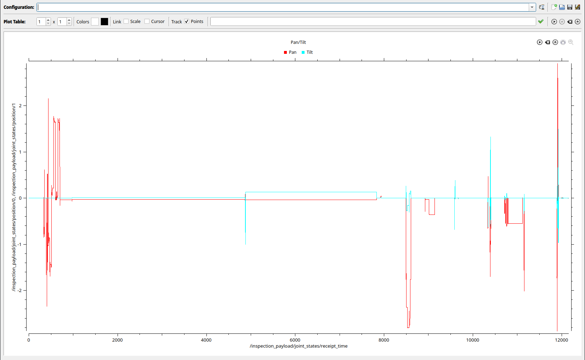
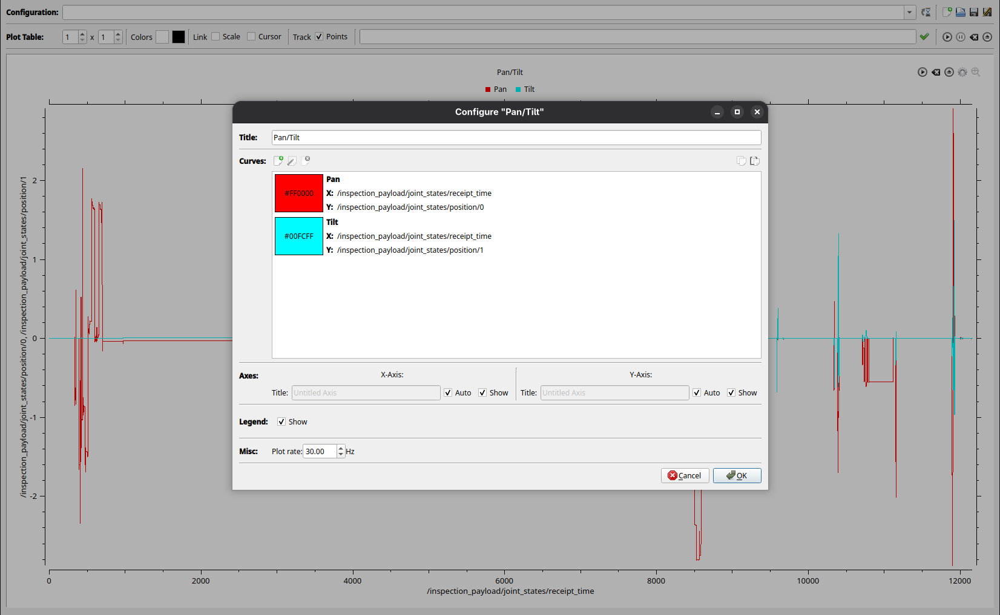
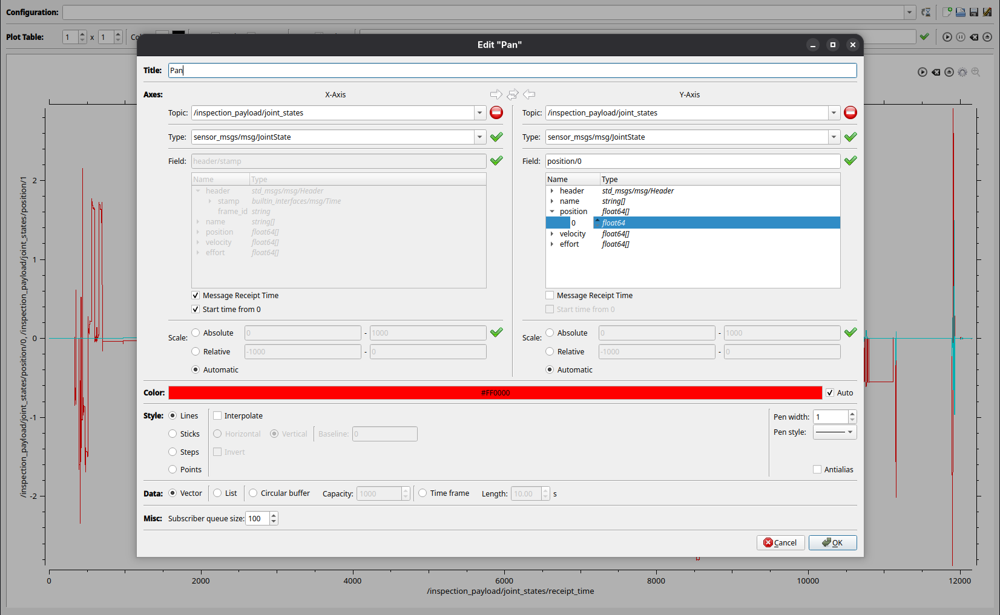

# Rqt Multiplot Plugin

[](https://github.com/samuelba/rqt_multiplot_plugin/actions/workflows/ci.yml?query=branch%3Amain)

rqt plugin for ROS 2 that plots numeric message fields in a grid of 2D plots ([Qwt](https://qwt.sourceforge.io)).

**Author(s):** Ralf Kaestner, Samuel Bachmann

**Maintainer:** Samuel Bachmann

**License:** GNU Lesser General Public License (LGPL)

## Features

- **Multiple plots and curves** — rows × columns of plots; each plot can hold many curves
- **Live topics and rosbag2** — subscribe while running, or import `.mcap` / `.db3` files and bag directories
- **Linked plots** — shared scale and cursor; optional point tracking under the pointer
- **Export** — PNG, SVG, PDF images; TXT or CSV curve data
- **Reusable layouts** — save and load XML configurations (`file://`, `home://`, `package://`)
- **Array snapshots** — plot a whole array vs index (or vs another array field); the curve is replaced on each message

Also: run / pause / clear, message receipt time, start time from 0, circular and time-frame buffers, and drag-and-drop of curves between plot legends.



## Installation

### ROS distribution

**Coming soon.** The package is not on the ROS build farm yet. After release:

```shell
sudo apt-get update
sudo apt-get install ros-jazzy-rqt-multiplot
sudo apt-get install ros-kilted-rqt-multiplot
```

### Building from source

Tested on ROS 2 Jazzy and Kilted. Put this repository in a colcon workspace `src` folder (clone or symlink), then:

```shell
cd ~/colcon_ws
rosdep install --from-paths src --ignore-src -y
colcon build --packages-select rqt_multiplot
source install/setup.bash
```

## Usage

Standalone plugin:

```shell
ros2 run rqt_multiplot rqt_multiplot
```

Or start rqt and load **Plugins → Visualization → Multiplot**:

```shell
rqt --force-discover
```

If the plugin list or layout is broken:

```shell
rqt --clear-config
```

Load a configuration, a bag, and start plotting:

```shell
ros2 run rqt_multiplot rqt_multiplot -- \
  --multiplot-config file:///path/to/layout.xml \
  --multiplot-bag /path/to/bag \
  --multiplot-run-all
```

| Option | Meaning |
| --- | --- |
| `--multiplot-config` / `-c` | XML layout URL |
| `--multiplot-bag` / `-b` | rosbag2 file or directory |
| `--multiplot-run-all` / `-r` | Start all plots immediately |

### Plot interaction

| Input | Action |
| --- | --- |
| Left drag | Pan |
| Ctrl + left drag | Draw a rectangle to zoom |
| Mouse wheel | Zoom in / out |
| Right click | Reset zoom |
| Hover (Points enabled) | Crosshair; nearest-sample marker and title / x, y readout |
| Drag a legend item onto another plot | Copy that curve |

Use the plot toolbar to run, pause, clear, configure, export, or maximize one plot.

**Link Scale** keeps axis ranges in sync across the grid. **Link Cursor** moves the crosshair on every plot. **Track Points** marks the nearest sample on each curve and shows its title and x, y.

### Configure a plot

Open the gear on a plot. Add curves, set axis titles, legend, and plot rate.



### Edit a curve

Pick topic, message type, and field for each axis. X and Y can come from different topics.



Useful curve options:

- **Message receipt time** — plot against the time the message arrived
- **Array index** — X (or Y) is `0..n-1` for the other axis’s array
- **Wildcard field** — `position/*` or `poses/*/position/x` plots every element; the series is replaced on each message
- **Start time from 0** — shift timestamps so the first sample is zero
- **Circular buffer** / **Time frame** — keep a fixed number of points or the last *n* seconds

Array snapshots need the same topic on both axes. A field path with `*` cannot be mixed with receipt time or a single scalar index. Indexed paths such as `position/0` stay ordinary time series.

Live topics for trying this:

```shell
ros2 run rqt_multiplot publish_array_demo.py
```

| Topic | Type | Try |
| --- | --- | --- |
| `/array_demo/floats` | `std_msgs/Float32MultiArray` | X array index, Y `data/*` |
| `/array_demo/joints` | `sensor_msgs/JointState` | Y `position/*` (length 4 ↔ 8) |
| `/array_demo/covariance` | `geometry_msgs/PoseWithCovariance` | Y `covariance/*` |
| `/array_demo/poses` | `geometry_msgs/PoseArray` | X `poses/*/position/x`, Y `poses/*/position/y` |
| `/array_demo/scan` | `sensor_msgs/LaserScan` | Y `ranges/*` |

### Import a bag

Configure the curves first (topics and fields must match the bag). Then **Import from bag file…** or **Import from bag directory…**.

Supported storage: `.mcap`, `.db3`, and a rosbag2 directory.

### Export

From the plot table or a single plot:

- Image: PNG, SVG, PDF
- Data: TXT (comment header) or CSV

## Bugs and feature requests

Use the [issue tracker](https://github.com/samuelba/rqt_multiplot_plugin/issues).
